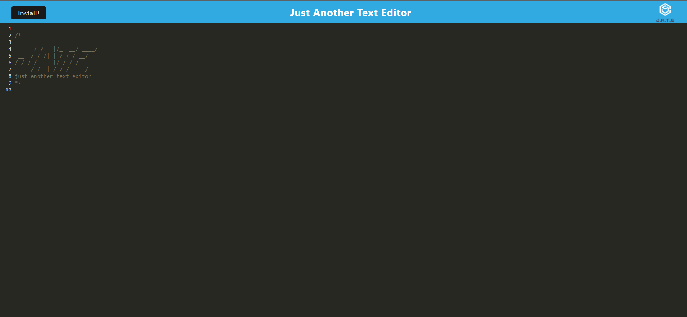
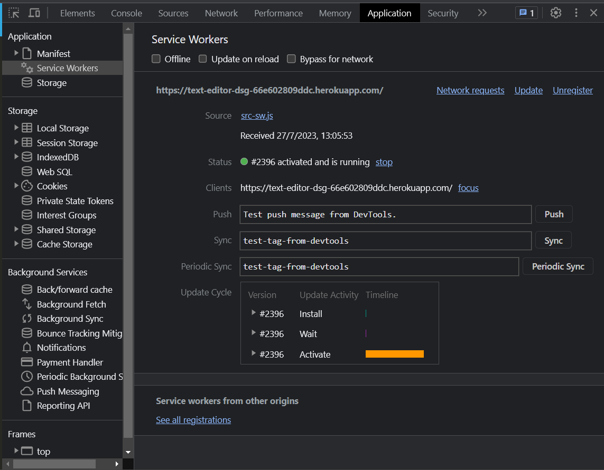
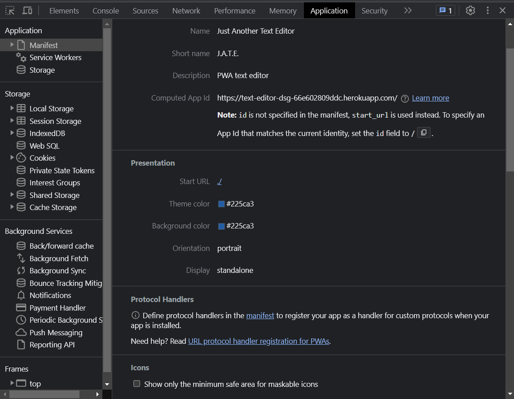
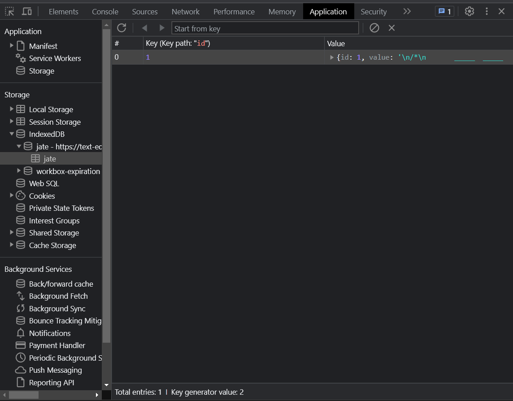
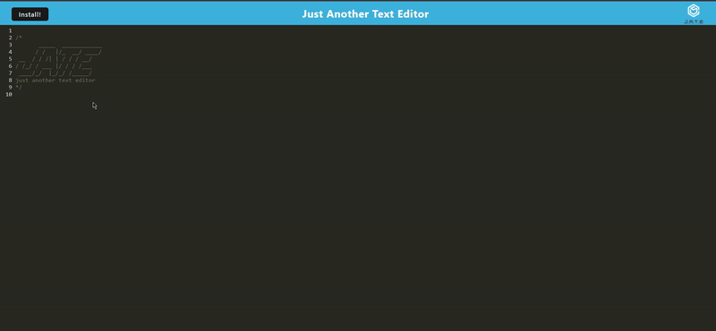

# PWA Text Editor <!-- omit in toc -->

</img>
</img>

 <h2>Dependencies</h2> 

 
    
    
    

## Table of contents <!-- omit in toc -->

- [Description](#description)
- [Usage](#usage)
- [Mock Up](#mock-up)
- [Credits](#credits)
- [License](#license)
- [Links](#links)

## Description
This application is a web text editor that allows the user to take notes & create code snippets without the need of an internet connection, saving the notes for later reference. The built-in service worker ensures proper functioning of the application, as well as caching unsaved data and images in case there is no internet connection. 

As a Progressive Web Application (PWA), the user can install this application on their computer for a more native experience with the application.

## Usage
Follow the heroku deployment in the [Links](#links) section to open the application. The application will automatically connect to the indexedDB in the browser, so all the user has to do is start typing! All data is saved even if the application is not online. For a more native application experience, click the *Install!* button to download the application.
### Deployment <!-- omit in toc -->
This application has been deployed in heroku. Please use the following link for [more information on the platform](https://www.heroku.com/platform).

## Mock Up
The following images demonstrate the functionality of the application.

        <h2>Homepage</h2>
    </img>
        <h2>Service Worker</h2>
    </img>
        <h2>Manifest</h2>
    </img>
        <h2>IndexedDB Storage</h2>
    </img>
        <h2>Functionality Demo</h2>
    </img>

## Credits
- Code by: [Daniel Sanchez](https://github.com/Morkendi)
- Starter code by: [Tec Bootcamps](https://github.com/coding-boot-camp/cautious-meme)

## License

This project utilizes an MIT License. [Read more](https://choosealicense.com/licenses/mit/)

## Links
- Link to [GitHub repo](https://github.com/Morkendi/Text-Editor)
- Link to [Deployment](https://text-editor-dsg-66e602809ddc.herokuapp.com/)